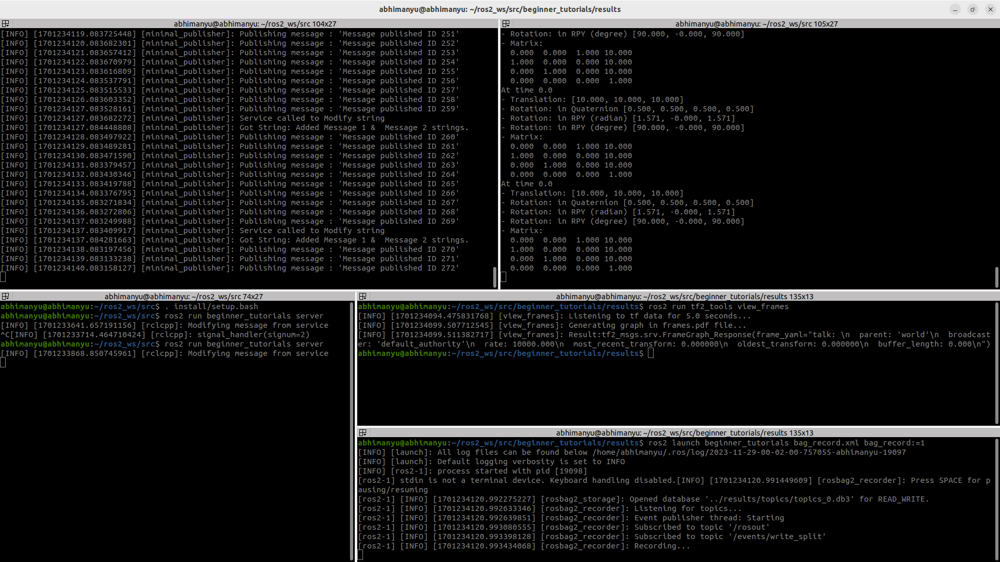
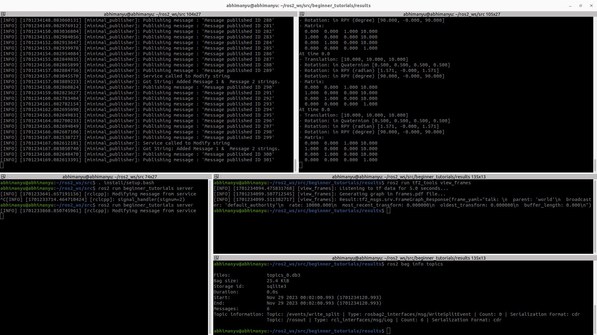

# Basic Pub - Sub using C++

Abhimanyu Saxena (asaxena4@umd.edu)

## Get started

### Environment and dependencies

#### System Dependencies

- Ubuntu 22.04
- ROS2 Humble

#### Package dependencies

- `rclcpp` - ROS2 C++ Client Library
- `std_msgs` - Standard Messages Library

The next steps assume you have set up a ROS2 workspace. 

### Cloning the repository

Run this command in the `src/` directory of your ROS2 workspace

```bash
git clone https://github.com/abhimanyu-saxena/beginner_tutorials.git beginner_tutorials
```

Build the package using

```bash
colcon build --packages-select beginner_tutorials
```

Source package

```bash
source install/setup.bash
```

The `result` folder contains cpplint and cppceck outputs along with screenshots of the results.

## Running the nodes for demonstration

Start the `talker` node in the first terminal

```bash
ros2 run beginner_tutorials talker
```

View the `transform` on the new terminal

```bash
ros2 run tf2_ros tf2_echo world talk
```

>**Note:** Source the workspace in the new terminal as well

Start the `service` node in the third terminal

```bash
ros2 run beginner_tutorials server
```

>**Note:** Source the workspace in the new terminal as well

Store the `tf` tree 

```bash
cd ~/ros2_ws/src/beginner_tutorials/results

ros2 run tf2_tools view_frames
```

>**Note:** Source the workspace in the new terminal as well


Record the `bag file` by running

```bash
cd ~/ros2_ws/src/beginner_tutorials/results

ros2 launch beginner_tutorials bag_record.xml bag_record:=1
```

>**Note:** Source the workspace in the new terminal as well

To view the recorded bag file

```bash
cd ~/ros2_ws/src/beginner_tutorials/results

ros2 bag info topics
```

>**Note:** Source the workspace in the new terminal as well

Hit `Crtl + C` in both the terminals to stop the nodes.

The tf2 data nd tf2 tree will look something like this:



The recorded bag file is read as:

