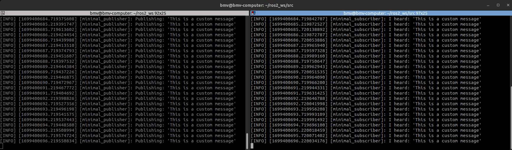

# Basic Pub - Sub using C++

Abhimanyu Saxena (asaxena4@umd.edu)

## Get started

### Environment and dependencies

#### System Dependencies

- Ubuntu 22.04
- ROS2 Humble

#### Package dependencies

- `rclcpp` - ROS2 C++ Client Library
- `std_msgs` - Standard Messages Library

The next steps assume you have set up a ROS2 workspace. 

### Cloning the repository

Run this command in the `src/` directory of your ROS2 workspace

```bash
git clone https://github.com/armgits/beginner_tutorials.git beginner_tutorials
```

Build the package using

```bash
colcon build --packages-select cpp_pubsub
```

Source package

```bash
source install/setup.bash
```

The `result` folder contains cpplint and cppceck outputs.

## Running the nodes for demonstration

Start the `talker` node in the first terminal

```bash
ros2 run cpp_pubsub talker
```

Start the `listener` node in the second terminal

```bash
ros2 run cpp_pubsub listener
```

>**Note:** Source the workspace in the new terminal as well

Hit `Crtl + C` in both the terminals to stop the nodes.

This will look something like this:

